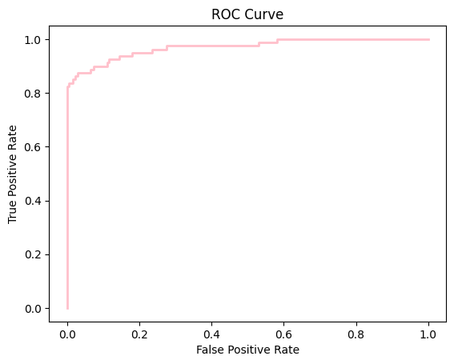

# Análise de Fraude com Machine Learning

Detecção de Transações Bancárias Fraudulentas

Este repositório apresenta um estudo prático de detecção de fraude utilizando um dataset de transações bancárias rotuladas como legítimas ou fraudulentas. O objetivo é aplicar técnicas de Machine Learning para identificar padrões, avaliar modelos e entender o impacto de penalidades e limiares em classificadores.

# Objetivo do Projeto

Explorar o comportamento das transações e a taxa real de fraudes

Criar modelos base e modelos supervisonados

Avaliar desempenho usando métricas adequadas para classes desbalanceadas

Visualizar curvas ROC, recall e análises por limiar

Testar diferentes penalidades e regularizações via grid search

# Sobre o Dataset

O conjunto de dados contém transações bancárias com um rótulo:

```Class = 0``` → transação legítima

```Class = 1``` → fraude

No notebook é calculada a porcentagem real de fraude, que normalmente é extremamente baixa — um desafio central em problemas de detecção de anomalias.

# Tecnologias Utilizadas

Python

Pandas

NumPy

Scikit-learn

Matplotlib

Seaborn (para heatmap do Grid Search)

Jupyter Notebook

# Pipeline do Projeto
1. Carregamento e Análise Inicial

Importação do dataset

Visualização inicial

Cálculo da porcentagem de transações fraudulentas

2. Divisão dos Dados
```python
X_train, X_test, y_train, y_test = train_test_split(X, y, random_state=0)
```
3. Modelo Base – Dummy Classifier

Uso de:

```DummyClassifier(strategy="most_frequent")```

Avaliado com:

Acurácia

Recall

Matriz de confusão

Serve como baseline para comparação.

4. Classificador Real – Regressão Logística

Treinamento com:
```python
LogisticRegression(max_iter=1500, random_state=0)
```

Geração de:

Probabilidades

Curva ROC

Avaliação de trade-off entre FPR e TPR

5. Análise de Penalidades e Limiar

Foi implementada uma função para:

Aplicar diferentes thresholds

Calcular métricas

Gerar uma curva de recall penalizado

Útil para cenários onde falsos negativos têm custo muito alto.

6. Grid Search e Heatmap

Visualização da busca em grade (L1 × L2, diferentes valores de C):

Heatmap usando seaborn

Interpretação visual da melhor combinação de hiperparâmetros

# Resultados Principais

Fraudes representam apenas uma pequena fração dos dados (dataset altamente desbalanceado).

O DummyClassifier alcança alta acurácia, porém recall 0 — mostrando que acurácia não é adequada para esse problema.

A Regressão Logística apresenta desempenho superior, especialmente quando analisada por limiar.

As curvas ROC e recall mostram claramente a sensibilidade do modelo à escolha do threshold.

O Grid Search identifica melhores combinações de regularização para lidar com o desbalanceamento.

---

# Introdução

Este conteúdo é parte de uma das tarefas deixada numa disciplina introdutória de machine learning. Nela vamos aplicar alguns métodos de classificação a partir de uma base de dados que contem transações bancarias 


```python
import numpy as np
import pandas as pd

# Import data
data = pd.read_csv("data_fraude.csv")
data.head()
```


<div>
<style scoped>
    .dataframe tbody tr th:only-of-type {
        vertical-align: middle;
    }

    .dataframe tbody tr th {
        vertical-align: top;
    }

    .dataframe thead th {
        text-align: right;
    }
</style>
<table border="1" class="dataframe">
  <thead>
    <tr style="text-align: right;">
      <th></th>
      <th>V1</th>
      <th>V2</th>
      <th>V3</th>
      <th>V4</th>
      <th>V5</th>
      <th>V6</th>
      <th>V7</th>
      <th>V8</th>
      <th>V9</th>
      <th>V10</th>
      <th>...</th>
      <th>V21</th>
      <th>V22</th>
      <th>V23</th>
      <th>V24</th>
      <th>V25</th>
      <th>V26</th>
      <th>V27</th>
      <th>V28</th>
      <th>Amount</th>
      <th>Class</th>
    </tr>
  </thead>
  <tbody>
    <tr>
      <th>0</th>
      <td>1.176563</td>
      <td>0.323798</td>
      <td>0.536927</td>
      <td>1.047002</td>
      <td>-0.368652</td>
      <td>-0.728586</td>
      <td>0.084678</td>
      <td>-0.069246</td>
      <td>-0.266389</td>
      <td>0.155315</td>
      <td>...</td>
      <td>-0.109627</td>
      <td>-0.341365</td>
      <td>0.057845</td>
      <td>0.499180</td>
      <td>0.415211</td>
      <td>-0.581949</td>
      <td>0.015472</td>
      <td>0.018065</td>
      <td>4.67</td>
      <td>0</td>
    </tr>
    <tr>
      <th>1</th>
      <td>0.681109</td>
      <td>-3.934776</td>
      <td>-3.801827</td>
      <td>-1.147468</td>
      <td>-0.735540</td>
      <td>-0.501097</td>
      <td>1.038865</td>
      <td>-0.626979</td>
      <td>-2.274423</td>
      <td>1.527782</td>
      <td>...</td>
      <td>0.652202</td>
      <td>0.272684</td>
      <td>-0.982151</td>
      <td>0.165900</td>
      <td>0.360251</td>
      <td>0.195321</td>
      <td>-0.256273</td>
      <td>0.056501</td>
      <td>912.00</td>
      <td>0</td>
    </tr>
    <tr>
      <th>2</th>
      <td>1.140729</td>
      <td>0.453484</td>
      <td>0.247010</td>
      <td>2.383132</td>
      <td>0.343287</td>
      <td>0.432804</td>
      <td>0.093380</td>
      <td>0.173310</td>
      <td>-0.808999</td>
      <td>0.775436</td>
      <td>...</td>
      <td>-0.003802</td>
      <td>0.058556</td>
      <td>-0.121177</td>
      <td>-0.304215</td>
      <td>0.645893</td>
      <td>0.122600</td>
      <td>-0.012115</td>
      <td>-0.005945</td>
      <td>1.00</td>
      <td>0</td>
    </tr>
    <tr>
      <th>3</th>
      <td>-1.107073</td>
      <td>-3.298902</td>
      <td>-0.184092</td>
      <td>-1.795744</td>
      <td>2.137564</td>
      <td>-1.684992</td>
      <td>-2.015606</td>
      <td>-0.007181</td>
      <td>-0.165760</td>
      <td>0.869659</td>
      <td>...</td>
      <td>0.130648</td>
      <td>0.329445</td>
      <td>0.927656</td>
      <td>-0.049560</td>
      <td>-1.892866</td>
      <td>-0.575431</td>
      <td>0.266573</td>
      <td>0.414184</td>
      <td>62.10</td>
      <td>0</td>
    </tr>
    <tr>
      <th>4</th>
      <td>-0.314818</td>
      <td>0.866839</td>
      <td>-0.124577</td>
      <td>-0.627638</td>
      <td>2.651762</td>
      <td>3.428128</td>
      <td>0.194637</td>
      <td>0.670674</td>
      <td>-0.442658</td>
      <td>0.133499</td>
      <td>...</td>
      <td>-0.312774</td>
      <td>-0.799494</td>
      <td>-0.064488</td>
      <td>0.953062</td>
      <td>-0.429550</td>
      <td>0.158225</td>
      <td>0.076943</td>
      <td>-0.015051</td>
      <td>2.67</td>
      <td>0</td>
    </tr>
  </tbody>
</table>
<p>5 rows × 30 columns</p>
</div>


Determinemos a porcentagem das observações no conjunto de dados que são casos de fraude


```python
def porcentagem_fraude():
    
    # Contando o número de instâncias de fraude (onde 'Class' == 1)
    fraud_count = data[data['Class'] == 1].shape[0]
    
    # Número total de observações
    total_count = data.shape[0]
    
    # Calculando a porcentagem de instâncias de fraude
    fraud_percentage = fraud_count / total_count
    
    return fraud_percentage
porcentagem_fraude()
```


    0.016410823768035772


Criando os X_train, X_test, y_train, y_test para os caculos 


```python
from sklearn.model_selection import train_test_split

X = data.iloc[:,:-1]
y = data.iloc[:,-1]

X_train, X_test, y_train, y_test = train_test_split(X, y, random_state=0)
```

Usando X_train, X_test, y_train e y_test (conforme definido acima), vamos treinar um classificador fictício que classifica tudo como a classe majoritária dos dados de treinamento. 


```python
from sklearn.dummy import DummyClassifier
from sklearn.metrics import accuracy_score, recall_score

dummy_clf = DummyClassifier(strategy="most_frequent")
dummy_clf.fit(X_train, y_train)
    
# Fazendo previsões
y_pred_clf = dummy_clf.predict(X_test)
```

Vejamos qual é a exatidão deste classificador e seu recall


```python
print('Exatidão do classificador: {:.2f}'
     .format(accuracy_score(y_test, y_pred_clf)))
print('Recall do classificador: {:.2f}'
     .format(recall_score(y_test, y_pred_clf)))

```

    Exatidão do classificador: 0.99
    Recall do classificador: 0.00
    

Agora treinemos um classificador SVC usando os parâmetros padrão.


```python
from sklearn.metrics import precision_score
from sklearn.svm import SVC

# Treinando o classificador SVC usando parâmetros padrão
svc_clf = SVC()
svc_clf.fit(X_train, y_train)

# Fazendo previsões
y_pred_svc = svc_clf.predict(X_test)
```

 Calculemos a exatidão, recall e precisão deste classificador


```python
print('Exatidão do classificador: {:.2f}'
     .format(accuracy_score(y_test, y_pred_svc)))
print('Recall do classificador: {:.2f}'
     .format(recall_score(y_test, y_pred_svc)))
print('Precisão do classificador: {:.2f}'
     .format(precision_score(y_test, y_pred_svc)))
```

    Exatidão do classificador: 0.99
    Recall do classificador: 0.35
    Precisão do classificador: 0.93
    

Usando o classificador SVC com parâmetros {'C': 1e9, 'gamma': 1e-07}


```python
svc_clf = SVC(C=1e9, gamma=1e-07)
svc_clf.fit(X_train, y_train)
```


<style>#sk-container-id-1 {
  /* Definition of color scheme common for light and dark mode */
  --sklearn-color-text: black;
  --sklearn-color-line: gray;
  /* Definition of color scheme for unfitted estimators */
  --sklearn-color-unfitted-level-0: #fff5e6;
  --sklearn-color-unfitted-level-1: #f6e4d2;
  --sklearn-color-unfitted-level-2: #ffe0b3;
  --sklearn-color-unfitted-level-3: chocolate;
  /* Definition of color scheme for fitted estimators */
  --sklearn-color-fitted-level-0: #f0f8ff;
  --sklearn-color-fitted-level-1: #d4ebff;
  --sklearn-color-fitted-level-2: #b3dbfd;
  --sklearn-color-fitted-level-3: cornflowerblue;

  /* Specific color for light theme */
  --sklearn-color-text-on-default-background: var(--sg-text-color, var(--theme-code-foreground, var(--jp-content-font-color1, black)));
  --sklearn-color-background: var(--sg-background-color, var(--theme-background, var(--jp-layout-color0, white)));
  --sklearn-color-border-box: var(--sg-text-color, var(--theme-code-foreground, var(--jp-content-font-color1, black)));
  --sklearn-color-icon: #696969;

  @media (prefers-color-scheme: dark) {
    /* Redefinition of color scheme for dark theme */
    --sklearn-color-text-on-default-background: var(--sg-text-color, var(--theme-code-foreground, var(--jp-content-font-color1, white)));
    --sklearn-color-background: var(--sg-background-color, var(--theme-background, var(--jp-layout-color0, #111)));
    --sklearn-color-border-box: var(--sg-text-color, var(--theme-code-foreground, var(--jp-content-font-color1, white)));
    --sklearn-color-icon: #878787;
  }
}

#sk-container-id-1 {
  color: var(--sklearn-color-text);
}

#sk-container-id-1 pre {
  padding: 0;
}

#sk-container-id-1 input.sk-hidden--visually {
  border: 0;
  clip: rect(1px 1px 1px 1px);
  clip: rect(1px, 1px, 1px, 1px);
  height: 1px;
  margin: -1px;
  overflow: hidden;
  padding: 0;
  position: absolute;
  width: 1px;
}

#sk-container-id-1 div.sk-dashed-wrapped {
  border: 1px dashed var(--sklearn-color-line);
  margin: 0 0.4em 0.5em 0.4em;
  box-sizing: border-box;
  padding-bottom: 0.4em;
  background-color: var(--sklearn-color-background);
}

#sk-container-id-1 div.sk-container {
  /* jupyter's `normalize.less` sets `[hidden] { display: none; }`
     but bootstrap.min.css set `[hidden] { display: none !important; }`
     so we also need the `!important` here to be able to override the
     default hidden behavior on the sphinx rendered scikit-learn.org.
     See: https://github.com/scikit-learn/scikit-learn/issues/21755 */
  display: inline-block !important;
  position: relative;
}

#sk-container-id-1 div.sk-text-repr-fallback {
  display: none;
}

div.sk-parallel-item,
div.sk-serial,
div.sk-item {
  /* draw centered vertical line to link estimators */
  background-image: linear-gradient(var(--sklearn-color-text-on-default-background), var(--sklearn-color-text-on-default-background));
  background-size: 2px 100%;
  background-repeat: no-repeat;
  background-position: center center;
}

/* Parallel-specific style estimator block */

#sk-container-id-1 div.sk-parallel-item::after {
  content: "";
  width: 100%;
  border-bottom: 2px solid var(--sklearn-color-text-on-default-background);
  flex-grow: 1;
}

#sk-container-id-1 div.sk-parallel {
  display: flex;
  align-items: stretch;
  justify-content: center;
  background-color: var(--sklearn-color-background);
  position: relative;
}

#sk-container-id-1 div.sk-parallel-item {
  display: flex;
  flex-direction: column;
}

#sk-container-id-1 div.sk-parallel-item:first-child::after {
  align-self: flex-end;
  width: 50%;
}

#sk-container-id-1 div.sk-parallel-item:last-child::after {
  align-self: flex-start;
  width: 50%;
}

#sk-container-id-1 div.sk-parallel-item:only-child::after {
  width: 0;
}

/* Serial-specific style estimator block */

#sk-container-id-1 div.sk-serial {
  display: flex;
  flex-direction: column;
  align-items: center;
  background-color: var(--sklearn-color-background);
  padding-right: 1em;
  padding-left: 1em;
}


/* Toggleable style: style used for estimator/Pipeline/ColumnTransformer box that is
clickable and can be expanded/collapsed.
- Pipeline and ColumnTransformer use this feature and define the default style
- Estimators will overwrite some part of the style using the `sk-estimator` class
*/

/* Pipeline and ColumnTransformer style (default) */

#sk-container-id-1 div.sk-toggleable {
  /* Default theme specific background. It is overwritten whether we have a
  specific estimator or a Pipeline/ColumnTransformer */
  background-color: var(--sklearn-color-background);
}

/* Toggleable label */
#sk-container-id-1 label.sk-toggleable__label {
  cursor: pointer;
  display: block;
  width: 100%;
  margin-bottom: 0;
  padding: 0.5em;
  box-sizing: border-box;
  text-align: center;
}

#sk-container-id-1 label.sk-toggleable__label-arrow:before {
  /* Arrow on the left of the label */
  content: "▸";
  float: left;
  margin-right: 0.25em;
  color: var(--sklearn-color-icon);
}

#sk-container-id-1 label.sk-toggleable__label-arrow:hover:before {
  color: var(--sklearn-color-text);
}

/* Toggleable content - dropdown */

#sk-container-id-1 div.sk-toggleable__content {
  max-height: 0;
  max-width: 0;
  overflow: hidden;
  text-align: left;
  /* unfitted */
  background-color: var(--sklearn-color-unfitted-level-0);
}

#sk-container-id-1 div.sk-toggleable__content.fitted {
  /* fitted */
  background-color: var(--sklearn-color-fitted-level-0);
}

#sk-container-id-1 div.sk-toggleable__content pre {
  margin: 0.2em;
  border-radius: 0.25em;
  color: var(--sklearn-color-text);
  /* unfitted */
  background-color: var(--sklearn-color-unfitted-level-0);
}

#sk-container-id-1 div.sk-toggleable__content.fitted pre {
  /* unfitted */
  background-color: var(--sklearn-color-fitted-level-0);
}

#sk-container-id-1 input.sk-toggleable__control:checked~div.sk-toggleable__content {
  /* Expand drop-down */
  max-height: 200px;
  max-width: 100%;
  overflow: auto;
}

#sk-container-id-1 input.sk-toggleable__control:checked~label.sk-toggleable__label-arrow:before {
  content: "▾";
}

/* Pipeline/ColumnTransformer-specific style */

#sk-container-id-1 div.sk-label input.sk-toggleable__control:checked~label.sk-toggleable__label {
  color: var(--sklearn-color-text);
  background-color: var(--sklearn-color-unfitted-level-2);
}

#sk-container-id-1 div.sk-label.fitted input.sk-toggleable__control:checked~label.sk-toggleable__label {
  background-color: var(--sklearn-color-fitted-level-2);
}

/* Estimator-specific style */

/* Colorize estimator box */
#sk-container-id-1 div.sk-estimator input.sk-toggleable__control:checked~label.sk-toggleable__label {
  /* unfitted */
  background-color: var(--sklearn-color-unfitted-level-2);
}

#sk-container-id-1 div.sk-estimator.fitted input.sk-toggleable__control:checked~label.sk-toggleable__label {
  /* fitted */
  background-color: var(--sklearn-color-fitted-level-2);
}

#sk-container-id-1 div.sk-label label.sk-toggleable__label,
#sk-container-id-1 div.sk-label label {
  /* The background is the default theme color */
  color: var(--sklearn-color-text-on-default-background);
}

/* On hover, darken the color of the background */
#sk-container-id-1 div.sk-label:hover label.sk-toggleable__label {
  color: var(--sklearn-color-text);
  background-color: var(--sklearn-color-unfitted-level-2);
}

/* Label box, darken color on hover, fitted */
#sk-container-id-1 div.sk-label.fitted:hover label.sk-toggleable__label.fitted {
  color: var(--sklearn-color-text);
  background-color: var(--sklearn-color-fitted-level-2);
}

/* Estimator label */

#sk-container-id-1 div.sk-label label {
  font-family: monospace;
  font-weight: bold;
  display: inline-block;
  line-height: 1.2em;
}

#sk-container-id-1 div.sk-label-container {
  text-align: center;
}

/* Estimator-specific */
#sk-container-id-1 div.sk-estimator {
  font-family: monospace;
  border: 1px dotted var(--sklearn-color-border-box);
  border-radius: 0.25em;
  box-sizing: border-box;
  margin-bottom: 0.5em;
  /* unfitted */
  background-color: var(--sklearn-color-unfitted-level-0);
}

#sk-container-id-1 div.sk-estimator.fitted {
  /* fitted */
  background-color: var(--sklearn-color-fitted-level-0);
}

/* on hover */
#sk-container-id-1 div.sk-estimator:hover {
  /* unfitted */
  background-color: var(--sklearn-color-unfitted-level-2);
}

#sk-container-id-1 div.sk-estimator.fitted:hover {
  /* fitted */
  background-color: var(--sklearn-color-fitted-level-2);
}

/* Specification for estimator info (e.g. "i" and "?") */

/* Common style for "i" and "?" */

.sk-estimator-doc-link,
a:link.sk-estimator-doc-link,
a:visited.sk-estimator-doc-link {
  float: right;
  font-size: smaller;
  line-height: 1em;
  font-family: monospace;
  background-color: var(--sklearn-color-background);
  border-radius: 1em;
  height: 1em;
  width: 1em;
  text-decoration: none !important;
  margin-left: 1ex;
  /* unfitted */
  border: var(--sklearn-color-unfitted-level-1) 1pt solid;
  color: var(--sklearn-color-unfitted-level-1);
}

.sk-estimator-doc-link.fitted,
a:link.sk-estimator-doc-link.fitted,
a:visited.sk-estimator-doc-link.fitted {
  /* fitted */
  border: var(--sklearn-color-fitted-level-1) 1pt solid;
  color: var(--sklearn-color-fitted-level-1);
}

/* On hover */
div.sk-estimator:hover .sk-estimator-doc-link:hover,
.sk-estimator-doc-link:hover,
div.sk-label-container:hover .sk-estimator-doc-link:hover,
.sk-estimator-doc-link:hover {
  /* unfitted */
  background-color: var(--sklearn-color-unfitted-level-3);
  color: var(--sklearn-color-background);
  text-decoration: none;
}

div.sk-estimator.fitted:hover .sk-estimator-doc-link.fitted:hover,
.sk-estimator-doc-link.fitted:hover,
div.sk-label-container:hover .sk-estimator-doc-link.fitted:hover,
.sk-estimator-doc-link.fitted:hover {
  /* fitted */
  background-color: var(--sklearn-color-fitted-level-3);
  color: var(--sklearn-color-background);
  text-decoration: none;
}

/* Span, style for the box shown on hovering the info icon */
.sk-estimator-doc-link span {
  display: none;
  z-index: 9999;
  position: relative;
  font-weight: normal;
  right: .2ex;
  padding: .5ex;
  margin: .5ex;
  width: min-content;
  min-width: 20ex;
  max-width: 50ex;
  color: var(--sklearn-color-text);
  box-shadow: 2pt 2pt 4pt #999;
  /* unfitted */
  background: var(--sklearn-color-unfitted-level-0);
  border: .5pt solid var(--sklearn-color-unfitted-level-3);
}

.sk-estimator-doc-link.fitted span {
  /* fitted */
  background: var(--sklearn-color-fitted-level-0);
  border: var(--sklearn-color-fitted-level-3);
}

.sk-estimator-doc-link:hover span {
  display: block;
}

/* "?"-specific style due to the `<a>` HTML tag */

#sk-container-id-1 a.estimator_doc_link {
  float: right;
  font-size: 1rem;
  line-height: 1em;
  font-family: monospace;
  background-color: var(--sklearn-color-background);
  border-radius: 1rem;
  height: 1rem;
  width: 1rem;
  text-decoration: none;
  /* unfitted */
  color: var(--sklearn-color-unfitted-level-1);
  border: var(--sklearn-color-unfitted-level-1) 1pt solid;
}

#sk-container-id-1 a.estimator_doc_link.fitted {
  /* fitted */
  border: var(--sklearn-color-fitted-level-1) 1pt solid;
  color: var(--sklearn-color-fitted-level-1);
}

/* On hover */
#sk-container-id-1 a.estimator_doc_link:hover {
  /* unfitted */
  background-color: var(--sklearn-color-unfitted-level-3);
  color: var(--sklearn-color-background);
  text-decoration: none;
}

#sk-container-id-1 a.estimator_doc_link.fitted:hover {
  /* fitted */
  background-color: var(--sklearn-color-fitted-level-3);
}
</style><div id="sk-container-id-1" class="sk-top-container"><div class="sk-text-repr-fallback"><pre>SVC(C=1000000000.0, gamma=1e-07)</pre><b>In a Jupyter environment, please rerun this cell to show the HTML representation or trust the notebook. <br />On GitHub, the HTML representation is unable to render, please try loading this page with nbviewer.org.</b></div><div class="sk-container" hidden><div class="sk-item"><div class="sk-estimator fitted sk-toggleable"><input class="sk-toggleable__control sk-hidden--visually" id="sk-estimator-id-1" type="checkbox" checked><label for="sk-estimator-id-1" class="sk-toggleable__label fitted sk-toggleable__label-arrow fitted">&nbsp;&nbsp;SVC<a class="sk-estimator-doc-link fitted" rel="noreferrer" target="_blank" href="https://scikit-learn.org/1.4/modules/generated/sklearn.svm.SVC.html">?<span>Documentation for SVC</span></a><span class="sk-estimator-doc-link fitted">i<span>Fitted</span></span></label><div class="sk-toggleable__content fitted"><pre>SVC(C=1000000000.0, gamma=1e-07)</pre></div> </div></div></div></div>


Calculemos a matriz de confusão ao usar um limite de -220 na função de decisão


```python
def matriz_confusao():
    from sklearn.metrics import confusion_matrix
    
    # Obtendo pontuações da função de decisão no conjunto de testes
    y_scores = svc_clf.decision_function(X_test)
    
    # Aplicando limite às pontuações da função de decisão
    y_pred_thresholded = (y_scores > -220).astype(int)
    
    # Calculando matriz de confusão
    cm = confusion_matrix(y_test, y_pred_thresholded)
    
    return cm
matriz_confusao()
```


    array([[5320,   24],
           [  14,   66]], dtype=int64)


Treinemos um classificador de regressão logística


```python
from sklearn.linear_model import LogisticRegression

# Treinando o classificador de regressão logística
log_reg = LogisticRegression(max_iter=1500, random_state = 0)
log_reg.fit(X_train, y_train)
    
# Estimativas de probabilidade para X_test
y_prob = log_reg.predict_proba(X_test)[:, 1]
```


```python
from sklearn.metrics import  RocCurveDisplay, roc_curve
import matplotlib.pyplot as plt

# Calculando a curva ROC
fpr, tpr, _ = roc_curve(y_test, y_prob)

# Plotando a curva ROC
plt.figure()
plt.plot(fpr, tpr, color='pink', lw=2)
plt.xlabel('False Positive Rate')
plt.ylabel('True Positive Rate')
plt.title('ROC Curve')
plt.show()
```


    

    


Para este classificador vamos criar uma curva de recall de precisão e uma curva roc usando y_test e y_prob (a estimativa de probabilidade para X_test, probabilidade de ser fraude). Posterimente, vamos criar uma função que para a curva de recuperação de precisão, determina qual é a recuperação quando a precisão é 0,75. Alem disso, para a curva roc determina a taxa de verdadeiros positivos quando a taxa de falsos positivos é 0,16.

Esta função retornará uma tupla da seguente estrutura (recall, taxa verdadeira positiva).


```python
def recall_true_pos_rate():
    from sklearn.metrics import precision_recall_curve

    # Calculando a curva de recuperação de precisão
    precision, recall, _ = precision_recall_curve(y_test, y_prob)
    
    # Encontrando o recall quando a precisão for 0,75
    recall_at_precision_075 = recall[np.where(precision >= 0.75)][0]
    
    # Encontrando a taxa de verdadeiros positivos quando a taxa de falsos positivos for 0,16
    idx = np.argmin(np.abs(fpr - 0.16))
    tpr_at_fpr_016 = tpr[idx]
    
    return (recall_at_precision_075, tpr_at_fpr_016)
recall_true_pos_rate()
```


    (0.825, 0.925)


Vamos realizar uma pesquisa de grade sobre os parâmetros listados abaixo para um classificador de regressão logística (com solver='liblinear'), usando recall para pontuação e a validação cruzada tripla padrão 

'penalidade': ['l1', 'l2']

'C':[0,01, 0,1, 1, 10]

Note que em .cv_results_, criamos uma matriz das pontuações médias dos testes de cada combinação de parâmetros, da seguente forma

|      	| `l1` 	| `l2` 	|
|:----:	|----	|----	|
| **`0.01`** 	|    ?	|   ? 	|
| **`0.1`**  	|    ?	|   ? 	|
| **`1`**    	|    ?	|   ? 	|
| **`10`**   	|    ?	|   ? 	|

<br>


```python
def matriz_penalidade():    
    from sklearn.model_selection import GridSearchCV

    param_grid = {'penalty': ['l1', 'l2'],
                  'C': [0.01, 0.1, 1, 10]}
    
    # Inicializando o classificador de regressão logística
    log_reg = LogisticRegression(solver='liblinear')
    
    # Realizando pesquisa em grade com pontuação de recall
    grid_search = GridSearchCV(log_reg, param_grid, scoring='recall')
    grid_search.fit(X_train, y_train)
    
    # Extraindo as pontuações médias dos testes de cada combinação de parâmetros
    mean_test_scores = grid_search.cv_results_['mean_test_score']
    
    # Remodelando as pontuações médias dos testes em uma matriz numpy 4x2
    mean_test_scores_array = np.array(mean_test_scores).reshape(4, 2)
    
    return mean_test_scores_array
    
pontos=matriz_penalidade()
print(pontos)
```

    [[0.69558442 0.77168831]
     [0.80792208 0.81155844]
     [0.80428571 0.81149351]
     [0.80064935 0.80064935]]
    

A função a seguir ajuda a visualizar os resultados da pesquisa em grade feita anteriormente


```python
def GridSearch_Heatmap(scores):
    %matplotlib notebook
    import seaborn as sns
    import matplotlib.pyplot as plt
    plt.figure()
    sns.heatmap(scores.reshape(4,2), xticklabels=['l1','l2'], yticklabels=[0.01, 0.1, 1, 10])
    plt.yticks(rotation=0)
    plt.show()

GridSearch_Heatmap(pontos)
```


    <IPython.core.display.Javascript object>


<div id='4904d8c8-dc11-4564-baa5-6d03b3f8d130'></div>


